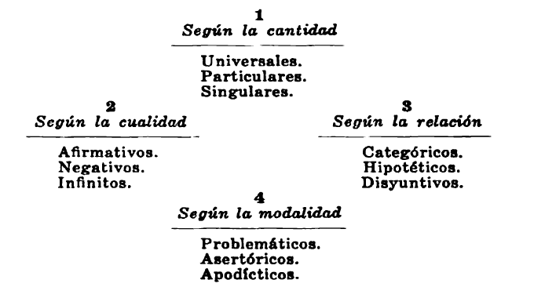
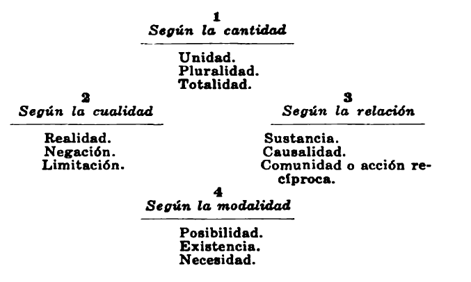

# Capítulo tercero: La física - Analítica trascendental

## Los conceptos

En el anterior capítulo hemos estudiado las condiciones que hacen posible el conocimiento matemático. Hemos visto que este conocimiento descansa, según Kant, en la intuición, como todo conocimiento sintético. Esta intuición es la del espacio y el tiempo. Pero aquí, en la matemática, esta intuición es pura, es decir, *a priori*; es la condición primera que hace posible la matemática, y al mismo tiempo también toda percepción sensible. Por eso pudo ser explicada la maravillosa conveniencia de la matemática con la realidad; ambas convienen porque tienen un mismo fundamento. porque las condiciones del conocimiento matemático son a la vez las condiciones de la experiencia.

Pero, además, de la intuición pura del espacio y del tiempo, y sobre esa intuición, realiza el matemático una labor intelectual. La intuición es como recortada y dividida en trozos, que son otras tantas figuras, números, etc. Estas figuras, estas series numerales establecidas por el matemático sobre la base de las intuiciones puras, no son ciertamente caprichos subjetivos de su imaginación; tienen realidad, puesto que se apoyan sobre la intuición del espacio y del tiempo, que es el elemento primero de todo lo real. El espacio se determina como recta, curva, triángulo, cuadrilátero, circulo, esfera, etc. El tiempo se determina en series diversas de números: par, impar, múltiplo, divisor, etc. Si consideramos, pues, no ya el espacio y el tiempo en general como intuiciones puras, sino estas determinaciones del espacio y del tiempo, deberemos caracterizarlas de un modo distinto del de la intuición pura, que les sirve de fundamento. El espacio vimos que era algo único, algo que no encerraba dentro de su definición multitud de objetos, algo, en realidad, que carecía de definición. De igual modo, el tiempo. Pero en cambio, estas determinaciones del espacio y del tiempo señalan cada uno una muchedumbre de objetos; el triángulo es una denominación que comprende multitud de triángulos, rectángulos, isósceles, equiláteros; el divisor es también una denominación que comprende muchos divisores. En suma: si el espacio y el tiempo son intuiciones, las determinaciones del espacio y del tiempo no lo son, puesto que indican que en su seno se cobijan multitud de objetos particulares. La matemática, para ser ciencia, requiere que, sobre el fundamento primero de la intuición pura, se definan, como partes de esa intuición, los objetos matemáticos, las figuras, los números. Estos objetos definidos llámanse conceptos.

Esta exigencia no es propia y peculiar de la matemática. Todo conocimiento científico requiere, como la matemática, objetos que conocer. La física tiene sus objetos: las propiedades generales de los cuerpos. La química tiene los suyos: las propiedades internas de cada cuerpo. La biología tiene los suyos: las propiedades de los cuerpos vivos. Pero podemos establecer entre la matemática y las demás ciencias una diferencia fundamental, y es que los objetos de la matemática nos son proporcionados por una intuición pura *a priori*, mientras que los objetos de las otras ciencias nos son proporcionados por intuiciones empíricas, mediante el vehículo de los sentidos. Por razón de esta diferencia, hemos tenido que estudiar primero la matemática aparte; necesitábamos darnos bien cuenta de por qué y cómo ocurría que la matemática, no tomando sus objetos de la percepción empírica, tiene, sin embargo, validez objetiva. Pero resuelta ya esta cuestión, no queda motivo alguno para seguir separando la matemática de la física. Ambas disciplinas son, como toda ciencia, un conocimiento de objetos.

Pero ¿de qué objetos? La ciencia no es, sin duda, el conocimiento de un objeto cualquiera. Este triángulo que yo tengo ahora pintado delante de mí, no es ciertamente el objeto de la geometría. Si yo digo que la suma de sus ángulos es igual a dos ángulos rectos, este conocimiento no se refiere a este triangulo singular pintado delante de mi, sino a todo triángulo, al triángulo en general. Tampoco el objeto de la mecánica es este movimiento ahora y aquí, sino todo movimiento, el movimiento en general. El físico no refiere su teorema a este solo fenómeno calórico observado por él, sino a todo fenómeno calórico en general. Los objetos de la ciencia no son, pues, los objetos singulares, sino los objetos generales. No hay conocimiento de lo singular, de lo particular. Sólo hay conocimiento de lo general, decía Aristóteles.

Ahora bien: esos objetos generales, únicos de que la ciencia se ocupa, ¿dónde están? Mis sentidos nunca me dan a percibir más que objetos singulares: este triángulo, este movimiento, este fenómeno térmico. Pero el triángulo, el movimiento, el fenómeno térmico en general, nunca los percibo, nunca tengo de ellos una intuición empírica. Los objetos generales, los objetos del conocimiento no son, pues, dados en la percepción, en la intuición sensible. Son pensados en la mente. El experimento que se lleva a cabo en el laboratorio de física es considerado por el físico como un caso, en donde se cumple una ley natural. Pero la ley misma, el objeto general, no está en ningún laboratorio; es pensada en la mente del físico, en la razón humana. Por eso se dice que los objetos generales que la ciencia quiere conocer son conceptos.

## La definición

¿Qué es un concepto? La respuesta a esta pregunta va a constituir la mayor parte de este capitulo. Es, por lo tanto, imposible darla ahora súbitamente de un modo satisfactorio. Pero si conviene adelantar alguna descripción, siquiera externa, de lo que hemos de entender por concepto. Cuando decimos, por ejemplo, flor, nos referimos a algo que para todos nosotros es, sin duda, claro; y sin embargo, no nos referimos a una flor concreta y particular. Si se nos enseña una rosa, diremos en seguida: eso es una flor; pero pensaremos ademas que muchas otras cosas son también una flor. Una psicología banal y vulgar afirmará que nuestro concepto de flor es una imagen desteñida, aplicable a todas las flores y contenida en nuestra mente, una a modo de florecilla diminuta pintada en nuestra imaginación. Pero si examinamos bien esta afirmación, pronto comprobamos su falsedad. Tratemos de ver interiormente esa supuesta imagen-concepto de flor. O no conseguiremos nada, o a lo sumo conseguiremos esbozar la imagen de una flor determinada, con exclusión de otras muchas flores. En realidad, mi imaginación puede reproducir muchas imágenes de flores; pero no puede reproducir la imagen de la flor, del concepto flor. Y, sin embargo, a pesar de esa incapacidad, yo sé perfectamente lo que es una flor. Cuando he tratado de reproducir la imagen de la flor en general, pude a lo sumo representar una rosa, acaso. Y al verla interiormente, dije: eso es una flor. Es decir, que me ocurrió lo mismo que si, en lugar de fingida, esa rosa me fuera realmente enseñada. ¿Qué significa esto? Que sigue habiendo entre la imagen interior y el concepto la misma diferencia que entre el ejemplar real y el concepto; que sigo entendiendo bajo el concepto flor algo totalmente distinto, no sólo de todo ejemplar real, sino de toda imaginación concreta. Ese algo, ese concepto, inconfundible con la imagen, es, sin embargo, muy claro y preciso. A él me refiero siempre que nombro un objeto percibido y lo clasifico en un grupo homogéneo.

Ahora ya podemos comprender mejor la relación de conocimiento. Conocer un objeto es referirlo al concepto a que pertenece; es propiamente reconocerlo, descubrir en él al concepto. Platón, en su lenguaje mítico, decía que conocer es recordar. En efecto, cuando ante un objeto singular cualquiera veo en él como realizado en concreto el concepto general, es como si en lugar del objeto particular pusiera el concepto, o como si el objeto particular me hiciera recordar al concepto y ascendiera a la dignidad de ejemplo o paradigma del concepto. Veo la rosa y digo: es una flor, como si en el lugar de la rosa presente pusiera el concepto de flor, o como si la rosa la considerase como un ejemplo, un caso de la flor. A esta inclusión del objeto en el concepto llamamos propiamente definición, Y un objeto es definido, o sea conocido, cuando es incluido en el concepto o sustituido por él. El concepto nos sirve, pues, de instrumento para acercarnos a las cosas singulares y conferirles significación general. Conocer es hacer conceptos.

Pero el concepto, a su vez, es definido, es decir, referido a otro concepto más general. Y esta serie de referencias, de enlaces y de síntesis de conceptos, constituye la trama toda del conocimiento científico. La ciencia quiere hacer el sistema de la naturaleza, esto es, el sistema de los conceptos, y su labor, proseguida infinitamente en el tiempo, plantea en cada momento, a cada generación, un problema determinado: el de hallar nuevos conceptos para poder definir las nuevas incógnitas.

## Origen de los conceptos

Nuestra investigación lógica llega, pues, ahora a una determinación precisa: ¿Cuál es el origen de los conceptos? ¿Cómo se forman? ¿Por qué son objetivos y por qué su uso es legitimo y valedero?

A estas preguntas da el empirismo una respuesta conocida. Los conceptos se forman por acumulación de percepciones semejantes o por unión de impresiones contiguas en el tiempo. En mi conciencia se suceden, repetidas una y otra vez, muchas percepciones semejantes. Caen unas sobre otras. El conjunto de todas ellas se unifica por si solo; límanse los salientes; redúcense las diferencias mínimas, y así se obtiene una imagen resultante, que es, aproximadamente, la reproducción de todas las mil percepciones singulares que la han engendrado. Este proceso ha sido por un lado de abstracción, puesto que las diferencias individuales han sido despreciadas y, como se dice, se ha hecho abstracción de ellas. Por otro lado, el proceso es de generalización, puesto que han sido conservadas sólo las semejanzas, los caracteres comunes a todas las percepciones, y han sido luego generalizados y extendidos, incluso a las percepciones singulares futuras. así el concepto es, para el empirismo, como esas fotografías colectivas que se obtienen superponiendo los clichés de individuos de una misma familia. La resultante es el retrato de una persona imaginaria, que no es ninguna de las que han entrado en la colección, pero que se parece a todas.

Otros conceptos se forman por contigüidad y por repetición de secuencias de fenómenos. Así el concepto de causa se origina en la reproducción de mil casos repetidos en que, sin excepción, a una misma impresión *a* he visto seguir siempre una misma impresión *b*. Prodúcese entre *a* y *b* un enlace, una asociación, y mi costumbre de ver siempre juntas las impresiones *a* y *b* hace que, presente *a*, aguarde la llegada inevitable de *b*. Esa costumbre, esa asociación, se expresan afirmando yo que *a es causa de b*. Por eso dice Hume que la causalidad, principio sobre que se sustenta la ciencia física, carece en realidad del valor universal y necesario que le atribuimos. Ese valor es fingido, es derivado abusivamente de la simple costumbre de ver *a* y *b* juntos en la experiencia, una, otra y mil veces.

Así obtenemos los conceptos según el empirismo. La ciencia o sistema de conceptos se reduce, pues, a un hábito de ver las cosas repetirse. Es experiencia, en el sentido que esta palabra tiene cuando la empleamos refiriéndonos a ese resto de prudencia y saber que la vida, al pasar, deposita en nuestra alma, como cuando decimos de un anciano que ha visto mucho y tiene, por lo tanto, mucha experiencia. El empirismo borra toda diferencia entre conocimiento vulgar -experiencia, en el sentido dicho- y conocimiento científico, puesto que niega al conocimiento científico universalidad y necesidad. Para el empirismo, todo conocimiento es siempre fruto de una impresión repetida que se inscribe en nuestra mente pasiva. Concibe la conciencia como un simple receptáculo, menos aún, como la luz que alumbra por dentro a cada sensación y a cada conjunto de sensaciones asociadas en grupos homogéneos.

## Crítica del empirismo

Kant ha sometido la doctrina empirista de la formación de los conceptos a una crítica profunda y minuciosa.

En primer lugar, esta teoría no consigue su propósito de explicar satisfactoriamente cómo se forman los conceptos. Hay en el concepto un elemento del que el empirismo no logra dar cuenta: la objetividad. El empirismo maneja solamente sensaciones, representaciones, percepciones. Con estos elementos puede llegar a explicar la formación de grupos homogéneos; pero serán siempre grupos de sensaciones, de representaciones, de impresiones subjetivas. El concepto, empero, no es eso; el concepto científico tiene un valor objetivo, es la ley o la razón de objetos reales, no de simples imágenes de los objetos. La ciencia sustituye a nuestra visión impresionista del universo, visión subjetiva hecha sólo de reacciones personales, visión inconexa llena de contradicciones, de imposibilidades, de incógnitas, un sistema lógico de conceptos, al que conferimos el valor de realidad plena. Y decimos precisamente que este sistema de leyes, de conceptos científicos, es realmente, objetivamente verdadero, mientras que aquella otra visión, la del niño, la del ignorante, la visión personal y consuetudinaria, la hecha de impresiones e imágenes, la declaramos falsa, ilusoria y subjetiva. Los juicios científicos que fallamos se refieren a esa realidad abstracta, que calificamos de preferentemente objetiva, y no a este espectáculo colorista y subjetivo de la naturaleza. La teoría empirista explica, pues, a lo sumo la formación de nuestras imágenes del mundo, pero no la formación de nuestro sistema, de nuestra ciencia del mundo. Empeñada en buscar el origen del conocimiento solamente en la sensación, se ve obligada a negar al conocimiento científico sus caracteres esenciales de objetividad -universalidad y necesidad-, porque éstos no son reductibles a sensaciones. En suma, tiene que confundir la ciencia exacta con la imagen impresionista, es decir, negar que la ciencia sea ciencia. El conocimiento lo hace consistir en la sola sensación; pero la sensación es mi sensación. El conocimiento no es, pues, de los objetos, de las cosas, sino de las impresiones subjetivas, y los conceptos no son conceptos de realidades, sino de modificaciones del yo. El empirismo, por plantear el problema del conocimiento en el terreno de la psicología, se condena a ser escéptico y, por relativismo psicologista, a negar la ciencia.

Pero no es ésta la única dificultad que presenta el empirismo. Si lo examinamos más de cerca, veremos que admite tácitamente, como verdades indudables, una porción de hipótesis, que no están, ni mucho menos, fundadas con certeza. Parte el empirismo de un hecho: nuestras representaciones se enlazan entre si por asociación. Pero para que eso ocurra para que las representaciones se asocien, es preciso suponer en ellas una regularidad general. El empirismo, en efecto, la supone, trata incluso de desentrañarla, y llega a formular las leyes de la asociación de las impresiones. Sólo el haber buscado esas leyes supone ya de antemano la hipótesis de que esas leyes existen, y de que efectivamente las impresiones por si mismas y en sí mismas están determinadas según una regla. Las asociaciones, los conjuntos de impresiones no podrían llegar a formarse, si al penetrar en  nuestra conciencia las sensaciones no siguiesen una pauta, no se agrupasen espontáneamente  en esos grupos o conjuntos. Dícese, por ejemplo, que algunos conceptos se forman por reunión de impresiones semejantes. Esto supone, empero, que cada impresión, penetrando en mi conciencia, va espontáneamente a buscar las impresiones semejantes anteriormente recibidas, para juntarse con ellas. La explicación empirista de la formación de los conceptos admite, pues, como tácita hipótesis la existencia de una afinidad entre las impresiones.

Mas esta afinidad, ¿cómo explicarla? ¿Suponiendo en el sujeto, en la conciencia, una actividad o potencia unificadora, una espontaneidad, en fin, para ordenar los materiales que la sensación suministra? El empirismo no puede, sin destruirse, aceptar esta solución, puesto que su tesis principal consiste en negar al espíritu toda actividad creadora y sintética y en concebirlo sólo como un receptáculo de impresiones, una especie de tabla rasa en donde van inscribiéndose sensaciones. Pero entonces tendrá que admitir esa afinidad de las sensaciones como una propiedad de las mismas, como algo, pues, totalmente casual, maravilloso, inexplicable. Así pues, la critica del empirismo podemos por ahora resumirla en dos graves cargos.

- Primero: la simple acumulación de impresiones daría por resultado una unidad psicológica subjetiva -experiencia vulgar-, pero no un concepto, es decir, una unidad real objetiva-conocimiento científico-.
- Segundo: la acumulación misma de representaciones en grupos homogéneos implica la suposición de que las representaciones se rigen por una afinidad interna, que el empirismo no puede explicar y tiene que admitir como un feliz azar.

Estos dos cargos tienen en el fondo un origen común. Si el empirismo no explica la objetividad de los conceptos, es precisamente porque supone ya esa objetividad en las impresiones, es porque cree que no hay más objetividad que la impresión. Parte, pues, ya de una real afinidad entre las impresiones, es decir, de una relación universal y necesaria entre ellas, independiente de la conciencia; ellas son ya de suyo un conjunto bien ordenado, y al pasar a nuestra conciencia, aportan ya consigo la conexión y regularidad que poseen. El fondo del pensamiento empirista, a pesar de toda la bravura psicológica de que hace gala, a pesar de su oposición ruidosa a toda metafísica. está sustentado en la más ingenua y más ortodoxa de las hipótesis metafísicas: la hipótesis de que la realidad, o sea las sensaciones, están en si mismas ordenadas, reguladas, dispuestas según leyes que sólo con aguzar los sentidos se descubrirán a nosotros, meros espectadores. Y se explica bien la salida de Hume de que para convencerse de que la suma de los dos ángulos de un triángulo es igual a dos rectas, no hace falta tanta tarea de demostración, sino sólo coger una escuadra y medir. Este punto de vista es el del hombre no científico, no matemático; es el punto de vista directo e ingenuo del hombre de acción.

El hombre de acción y de lucha no puede detenerse en especular exacta y metódicamente; su acción, su vida, son para él los únicos criterios de verdad, y la experiencia vulgar, amasada por sus andanzas en el mundo, es el único guía teórico que admite. Esa experiencia que la vida nos proporciona es, empero, constantemente rectificada y corregida por la acción, producida en suma por la acción. El empirismo, al no querer concebir la ciencia desde un punto de vista lógico, empeñado en analizarla psicológicamente, la confunde e identifica con ese conocimiento vulgar oriundo de la acción. La verdad le aparece así como un medio, y para adherirse a ella, le bastará con que efectivamente sirva en la vida, tenga en la práctica aplicación fructífera. El empirismo acaba naturalmente en pragmatismo.

Pero frente a la actitud del hombre de acción está la actitud especulativa. Las ciencias exactas no son experiencia práctica. La especulación no se satisface con un teorema que sirva; quiere, además, que sea verdaderamente verdadero. El máximo fin de la actividad científica es desinteresado: el descubrimiento de verdades objetivas. El especulativo no es hombre de acción, no siente impaciencias, no tiene prisa. Es, como decía Platón, un ocioso que dispone siempre del tiempo suficiente para no dejar pasar nada sin examen detenido, para no admitir nada sin sólidas pruebas.

Y ¿cómo vamos a admitir sin pruebas esa maravillosa casualidad de que nuestras impresiones, tan a las claras subjetivas sean, sin embargo, de suyo y por si objetivas y compongan de suyo y por si un mundo conexo de relaciones universales y necesarias, de conceptos en fin? Nos hallamos aquí de nuevo ante un problema semejante al que hemos examinado en el capitulo anterior. La coincidencia maravillosa entre la matemática y la realidad era ese problema. El dogmatismo racionalista admitía sin discusión esa maravillosa compenetración. Pero la crítica. hubo de mostrar que las condiciones de la matemática y las condiciones de la realidad eran unas y las mismas. De igual modo ahora el dogmatismo empirista admite sin discusión la objetividad del espectáculo sensible del mundo, o mejor dicho, no cree que haya más objetividad que la sensación; hace del mundo una mera impresión subjetiva. Pero la crítica del conocimiento científico objetivo ha de instituir aquí su investigación peculiar. ¿Qué es objetividad? ¿Qué significa ser objeto real? O como dice Kant: ¿Qué se entiende cuando se habla de un objeto que corresponde al conocimiento, y, por lo tanto, distinto de éste?» así la filosofía kantiana persevera en el camino del método trascendental -palabra cuyo significado quedó explicado en el capitulo anterior-, y trata de indagar por qué el conocimiento científico posee la objetividad.

## La unidad sintética

¿Qué se entiende, pues, por objeto real del conocimiento?

Ante mis ojos yace un libro. Este es un objeto. El libro tiene tal o cual forma, tal o cual color. Pero el libro no es la forma ni el color, sino algo que posee esa forma y ese color. Ahora cojo el libro y lo peso en una balanza. El libro tiene tal peso; pero el libro no es su peso, sino algo que tiene ese peso. Cuento las páginas y hallo que son éstas 420. Pero el libro no es 420 páginas, sino algo que tiene 420 páginas. Leo el libro y lo encuentro agradable. El libro no es mi agrado, sino algo que me produce agrado. así sucesivamente, cuanto voy percibiendo en el libro lo atribuyo al libro, pero siempre con la restricción de que el libro es algo que posee la cualidad que le atribuyo. Sumemos todas las propiedades que atribuyo o puedo atribuir al libro. Siempre seguiré pensando que el libro no se confunde con la suma de esas propiedades, sino que es algo distinto de ellas, algo que las posee. Sin embargo, por otra parte, si yo voy sucesivamente imaginando el libro desprovisto una tras otra de esas cualidades, acabará por desaparecer totalmente. Por un lado, pues, el objeto libro desaparece totalmente cuando desaparecen las percepciones que yo tengo de él. Pero por otro lado, no puedo considerar d objeto libro como la suma de las percepciones percibidas en él, sino que sigue siendo el algo, la 2: a quien pertenecen esas percepciones, esas propiedades. El empirismo tiene razón cuando dice: quitad las impresiones y suprimís el objeto. Pero no tiene razón cuando concluye: luego el objeto es la suma de las impresiones, pues bien a las claras se manifiesta que el objeto es propiamente ese algo, esa 2: a quien atribuimos sucesivamente todas y cada una de las impresiones, sin confundirse con la suma de éstas.

Pero la serie de una muchedumbre de impresiones percibidas por mi no puede, naturalmente, ser percibida más que en el tiempo, esto es, sucesivamente. Yo percibo las impresiones una después de otra. Mas cuando recibo la segunda, ya ha pasado la primera; cuando recibo la tercera, ya huyó la segunda. Para hacer con todas ellas un objeto, hace falta, pues, ante todo que cada impresión, una vez recibida, no se vaya. Y se iría indefectiblemente, si no fuera retenida por mi, si no fuera recordada. Necesito, pues, una actividad espiritual, la memoria, la capacidad de retener impresiones para poder con ellas hacer un objeto.

Pero esta actividad no basta todavía. Aun suponiendo presentes en la conciencia por medio de la memoria todas las impresiones necesarias, éstas no constituyen aún un objeto. Yo no puedo establecer entre ellas más que una relación de sucesión; yo no puedo decir de ellas  sino que han sido recibidas por mi una tras otra. Pero necesito poder decir más; necesito poder decir que unas y otras forman un solo objeto. Mas ese objeto yo no lo poseo. Para formarlo, es necesario que yo suponga un algo, una x, y luego que atribuya mis impresiones a ese algo, a esa as, diciendo que no son impresiones mías, sino cualidades o propiedades de esa x, de ese algo. Así, pues, la actividad de mi conciencia, que supone una x, un algo como substrato de las impresiones por mi recibidas, sirve para dos cosas: primero, para referir cada impresión a ese algo, a ese substrato x, y segundo: para que, mediante esa referencia, las impresiones no sean simplemente sucesivas en mi consciencia, sino enlazadas objetivamente entre si.

Para hacer más clara esta argumentación, distingamos dos clases de unidad en que puedan estar mis impresiones: una, cuando sólo merced al recuerdo se amontonan en mi consciencia; otra, cuando cada impresión, por haber sido referida a un substrato x, como propiedad o cualidad de éste, resulta enlazada con todas las demás impresiones y unida a todas ellas. La primera especie de unidad, el amontonamiento, no puede ser más que subjetiva, porque en ella la impresión no es más que mi impresión. Pero la segunda unidad es ya objetiva, porque la unión mutua de las impresiones no es un simple amontonamiento en mi consciencia, sino que resulta de que cada impresión ha sido previamente referida a ese algo, a esa x, que es propiamente el objeto. Mis impresiones subjetivas se han tornado en propiedades del objeto, se han hecho objetivas merced a esta segunda especie de unidad. Llamémosla unidad sintética. Podremos decir, en conclusión, que la objetividad es la unidad sintética de las impresiones; la condición fundamental para que las impresiones formen un objeto es que se unan por medio de una unidad sintética. Esa x, ese algo, ese como sostén o substrato o punto y foco de referencia al que convergen todas las impresiones, es indispensablemente necesario para que podamos hablar de objetos. Y no es preciso ciertamente que el objeto sea percibido para que tenga unidad sintética. Los objetos matemáticos, que no son percibidos, sino pensados, tienen unidad sintética. El triángulo no es solamente el pensamiento sucesivo de tres rectas, sino el enlace de las tres en una unidad especial; el triangulo es la 2:, la cosa que posee tres ángulos, tres lados, que tiene ésta y aquélla propiedad. Todo objeto, pues, sea empírico, sea racional, está constituido por un núcleo, propiamente objetivo, llamado unidad sintética, que es el lazo que mantiene y sostiene sus propiedades.

He aquí, pues, lo que le faltaba al empirismo para dar cuenta de la formación de los conceptos. El empirismo no lograba explicar la objetividad del concepto y, por tanto, la objetividad del conocimiento. Por eso el conocimiento era para él algo subjetivo, una acumulación de las sensaciones que cosechamos durante el paso por la vida. Pero desde el momento en que reconocemos en la obra científica una actividad espontánea de la consciencia, cuando consideramos el intelecto científico, no como un mero receptáculo de sensaciones, sino como un esfuerzo positivo organizador de las sensaciones, entonces podemos explicarnos enteramente el carácter objetivo de los conceptos, entonces no estamos ya ante el sistema del mundo como ante una ficción consuetudinaria, sino como ante la misma realidad de las cosas. En la elaboración del conocimiento hay, pues, una originaria actividad del entendimiento, una actividad *a priori*. El entendimiento es el que pone o supone -sub-ponere- la unidad sintética, esto es, la objetividad misma. Los objetos se componen ciertamente de impresiones; si suprimimos las impresiones, suprimimos los objetos. Mas con impresiones solas no se ve de dónde puede surgir la objetividad. Necesitamos, pues, añadir a las impresiones un enlace que las junte orgánicamente, por decirlo así, no en montón, sino en relación de pertenencia al objeto. Tal es la función del entendimiento que proporciona al concepto científico  su carácter esencial de objeto real, dando a las impresiones unidad sintética.

## Función sintética del juicio

Y esta suposición -*sub-positio*-, esta función sintética *a priori* del pensamiento, ¿no podremos determinarla con más exactitud y abundancia? Por lo pronto, sabemos ya que es una función de síntesis. Consiste, primero, en juntar, en unir impresiones. Pero juntar impresiones no sería hacer una síntesis de ellas: seria hacer una suma. La función del entendimiento no es sólo juntar impresiones, sino atribuirlas al objeto, a la *x* supuesta. Este ayuntamiento de impresiones merece el nombre de sintético, porque se expresa mediante el verbo sustantivo, que es el signo de la objetividad. Mi impresión, decimos, es una propiedad del objeto. En una palabra: la función sintética objetivadora es la función de atribuir un predicado a un sujeto, es la función lógica del juicio. Cuando formulamos un juicio decimos que una determinada cualidad pertenece a un objeto, le pertenece a él, no a nosotros, que juzgamos. Sea el juicio siguiente: el calor dilata los cuerpos. Significa que el calor tiene, posee la propiedad de dilatar los cuerpos. Entre el objeto calor y la propiedad de dilatar los cuerpos hemos establecido una unidad sintética. Intentemos ahora definir qué sea el calor, qué sea cuerpo, etc. Todos esos objetos se resolverán a su vez en un haz de juicios, en los cuales una propiedad será atribuida al objeto sintéticamente. La actividad del pensamiento, cuando forma conceptos objetivos, no es, pues, otra que la capacidad de hacer juicios. Partiendo de la suposición de una *x*, de un algo incógnito que se trata de conocer, vamos poco a poco conociendo y determinando esa *x* mediante una serie inacabable de juicios sintéticos, que consisten todos en atribuir a esa *x*, a ese algo, alguna propiedad, que no es solamente una impresión mía, sino una real propiedad de la cosa. Ahora bien: ese algo, ese substrato supuesto como base y sostén del objeto, ¿qué es si prescindimos de todas las propiedades que le atribuimos? No es ninguna sensación, puesto que hemos prescindido, por hipótesis, de todas las propiedades que podamos atribuirle. No es nada más que un punto de reunión ideal, una noción previa, desprovista de toda concreción; es el objeto antes de toda determinación, o, como dice Kant, el concepto de un objeto en general.

Detengámonos un instante a recapitular. Llamábamos unidad sintética a la especial manera que tienen las impresiones de juntarse cuando constituyen un objeto o concepto real; las impresiones se juntan refiriéndose todas al objeto como sus propiedades. Pero este objeto, si prescindimos de sus propiedades, o sea de las impresiones, no es nada más que el concepto de un objeto en general. así, pues, el concepto de un objeto en general es el supuesto primero, la condición *a priori* de toda síntesis real; es la unidad sintética antes de ser real, antes de las impresiones; es, en suma, la *unidad sintética pura a priori*. El conocimiento científico nos aparece con el carácter fundamental de ser el conocimiento de algo y no sólo la enumeración de nuestras impresiones. Ahora bien, ese algo, el puro objeto del conocer, no nos es dado en la sensación, ya que las sensaciones son solamente las determinaciones de ese algo. Si, pues, no nos es dado en la sensación, es supuesto implícitamente como fundamento del conocimiento, es una posición a. Sin ella carecería el conocimiento de objetividad, pues que carecería de objeto. La objetividad del conocimiento o, de otro modo dicho, su universalidad y su necesidad, su carácter científico, tienen origen lógicamente en esa primera afirmación o posición del concepto de un objeto general, cuya determinación, constantemente corregida, constituye el saber del hombre.

El conocimiento, como sistema de los objetos, implica, pues, la posición primera del concepto de un objeto en general, que también hemos llamado unidad sintética pura a priori. Consideremos ahora las diversas modalidades formales que pueda presentar ese concepto de un objeto en general, esa unidad sintética pura, en el acto de determinarse empíricamente. Porque, en efecto, cuando mis impresiones sobrevienen para determinar el objeto, el algo que ha de ser conocido, sucede que la manera que tengan de referirse a ese algo puede ser diferente. Unas veces las impresiones determinarán el objeto, juntándose a él como sus propiedades; otras veces como causadas por él, aunque no pertenecientes a él; otras veces como siendo la repetición en serie del objeto mismo. Si conseguimos descubrir estas modalidades fundamentales, habremos obtenido los tipos elementales de objetividad, es decir, las maneras elementales con que algo es objeto de conocimiento.

La posición primera es, como hemos dicho, la unidad sintética pura. ¿Hay modos diferentes de unir sintéticamente? La función sintética propia del entendimiento la conocemos en la operación intelectual del juicio. El juicio es la expresión de la unidad sintética. Ahora bien: en el juicio podemos prescindir del contenido -las impresiones unidas- y estudiar sólo el modo de la unión, o sea la forma. La lógica formal hace ese estudio del juicio y descubre diversos modos de realizarse esa unión. La clasificación que la lógica formal hace de los juicios podrá, pues, servirnos para descubrir los modos de la unidad sintética pura, o sea los tipos fundamentales de objetividad.

## Clasificación de los juicios

Pues bien, la lógica formal, como es sabido, distingue cuatro aspectos en los juicios: **la cantidad, la cualidad, la relación y la modalidad**. Según la **cantidad**, los juicios se dividen en *universales, particulares* y *singulares*. *Universales* son aquellos en que el sujeto está tomado en toda su extensión, como: todos los hombres son mortales. *Particulares* son aquellos en que el sujeto está tomado en parte de su extensión, como: algunos hombres son europeos. *Singulares* son aquellos en que el sujeto es un individuo, como: Juan es pobre.

Según la **cualidad**, los juicios se dividen en *afirmativos, negativos* e *infinitos*. Son *afirmativos* los que atribuyen el predicado al sujeto. Son *negativos* los que excluyen el sujeto del predicado. Son *infinitos* los que incluyen el sujeto en cualquier clase o concepto que no sea el del predicado, como: el alma es inmortal, juicio por el cual yo no niego nada del sujeto; pero tampoco le atribuyo afirmativamente nada, y me limito a dejarle abierta una serie infinita de posibilidades, siempre que no sea la mortalidad. Kant fue el que introdujo estos juicios infinitos en la clásica tabla de los juicios según la cualidad.

Según la **relación**, los juicios se dividen en *categóricos, hipotéticos* y *disyuntivos*. Juicio *categórico* es aquel cuyo predicado se considera perteneciente al sujeto, sin condición ni limitación alguna, como: el triángulo tiene tres ángulos. Juicio *hipotético* es un juicio cuya verdad depende de que sea cierto otro juicio, como: el termómetro sube, si hace calor. Juicio *disyuntivo* es un conjunto de juicios relacionados entre si de suerte que la validez de uno de ellos excluye la validez de todos los demás, pero el conjunto constituye un conocimiento, como: el mundo existe, o por ciego azar, o por interna necesidad, o por una causa exterior.

Según la **modalidad**, los juicios se dividen en *problemáticos, asertóricos* y *apodícticos*. *Problemáticos* son los juicios en donde la atribución del predicado al sujeto vale sólo como posible; ejemplo: cualquiera de los dos juicios que forman nuestro ejemplo del juicio hipotético, o cualquiera de los tres que formaron el ejemplo del disyuntivo. *Asertóricos* son los juicios verdaderos que, sin embargo, no son necesariamente verdaderos, es decir, que pudieran ser falsos, como, por ejemplo: el termómetro sube (puesto que hace calor). *Apodícticos* son los juicios que son necesariamente verdaderos, es decir, que no pueden no serlo, como: todos los diámetros de una circunferencia son iguales.

En el siguiente cuadro se obtiene el conjunto de la clasificación de los juicios:

## Las categorías

Los doce tipos de juicio enumerados en el cuadro anterior, se distinguen unos de otros sólo por la manera de llevar a cabo la síntesis del predicado con el sujeto. La división que la lógica formal hace de los juicios es, pues, totalmente independiente del contenido real empírico de los mismos, y se refiere sólo al modo de la síntesis. Por lo tanto, las diferentes clases de juicios nos descubren otros tantos modos de la síntesis. Y como la división de los juicios ha sido hecha prescindiendo del contenido empírico, resulta que los modos de la síntesis que descubrimos son los modos de la síntesis pura *a priori*, o sea las modalidades fundamentales del concepto de un objeto en general.

Los juicios de la cantidad nos revelan tres formas fundamentales de la objetividad en general: **la unidad, la pluralidad, la totalidad**. Los juicios de la cualidad nos revelan **la realidad, la negación, la limitación**. Los juicios de la relación nos descubren **la sustancia, la causalidad y la comunidad o acción recíproca**. Y, por último, lo juicios de la modalidad nos descubren la **posibilidad, la existencia, la necesidad**.

En el siguiente cuadro se obtiene el conjunto de la clasificación de los modos de la objetividad en general:

A estas formas primeras de toda objetividad en general ha dado Kant el nombre de *conceptos puros del entendimiento*, y también el de *categorías*. Son, en efecto, conceptos, puesto que son las unidades sintéticas fundamentales, a las que referimos las impresiones. Pero esos conceptos son puros, es decir, *a priori*, puesto que no señalan objetos empíricos determinados, sino solamente la condición, el supuesto que nos sirve de base para organizar nuestras impresiones y obtener objetos empíricos reales. No han sido obtenidos por medio de síntesis empíricas juntando sensaciones, sino que son ya propuestos a toda síntesis empírica, y sólo por ellos es posible una síntesis empírica determinada. Nunca percibimos la unidad, la causalidad, la sustancia; pero estos tres conceptos puros nos sirven para decir que el objeto es uno, que es causa, que es sustancia.

También les da Kant el nombre de categorías. Este nombre lo usó Aristóteles para significar con él los conceptos más generales, aquellos que pueden decirse y afirmarse de toda cosa. Pero entre el sentido y el sistema de las categorías de Kant y la lista de Aristóteles hay profundas diferencias. No es sólo que ambas tablas no coinciden ni en el número ni en la designación de las categorías; es, sobre todo, que el método para obtenerlas y el sentido de la teoría son totalmente diferentes. La lista de las categorías aristotélicas carece de un principio que permita obtenerla y determinarla exactamente. Aristóteles ha reunido sus categorías un tanto al azar, por disección de la experiencia, comparando casos y juicios sueltos, como cuando el estudio de una lengua nos hace descubrir sus reglas gramaticales. La lista de Aristóteles no es un sistema, sino una mera lista, una rapsodia, un recuento empírico que carece de la certeza y seguridad que sólo proporciona un principio director. Así ocurre que en esa lista hay incluidas intuiciones -modos de la sensibilidad, que no son conceptos-, como el cuándo, el dónde, el lugar, el antes, y hay también conceptos empíricos, como el movimiento.

Mas esta falta de sistema en el establecimiento de las categorías aristotélicas proviene principalmente de que el sentido de toda la teoría, en Aristóteles, es más bien metafísico que lógico. La lógica de Aristóteles es formal, porque su metafísica es finalista. Ya hemos dicho en el capitulo anterior que Aristóteles concibe el mundo como un sistema de fines que convergen todos en un fin final, forma última, la cual es pura función y no órgano para ulteriores funciones. La lógica, pues, debe plegarse y adaptarse a esta concepción, y por eso los conceptos forman una escala ascendente y descendente en la extensión y la comprensión recíprocas. Era urgente, por tanto, enumerar aquellos conceptos que fuesen tan generales que pudiesen ser predicados siempre; y esos conceptos no podrán ser otros que los elementos primordiales del universo, aquellos órganos, por decirlo así, cuyas funciones fuesen necesarias en todo ser. No había, para encontrarlos, más camino que el de buscarlos uno por uno, apreciando, por repetidos ensayos, el grado de su generalidad. Y resulta fácil de comprender que Aristóteles haya admitido entre ellos algunos, como el cuándo, el dónde, el lugar, que no son conceptos, sino intuiciones del espacio y del tiempo; es que en esas intuiciones encontraba él la máxima generalidad que iba buscando.

## Sentido de las categorías kantianas

Las categorías de Kant, en cambio, son, ante todo, las condiciones lógicas de la objetividad en general. No son los elementos primordiales o esenciales del universo, sino simplemente las afirmaciones implícitas en todo conocimiento objetivo, sin las cuales no habría conocimiento. Cuando yo afirmo que *B* es una propiedad de *A*, supongo ya de antemano que *A* es algo -sustancia-. Si yo digo que *A* es causa de *B*, supongo ya de antemano el concepto puro de causalidad. Si afirmo que *A* se divide en tres partes admito como previos los conceptos de pluralidad y de unidad. De suerte que me es imposible pensar -conocer científicamente- sin esos conceptos primeros y fundamentales, que son las categorías. Puede decirse que las categorías son las condiciones *a priori* del conocimiento científico. En efecto, pensar, conocer, es verificar síntesis valederas de mis impresiones. Cuando entre mis impresiones sobreviene una que no puede entrar a formar unidad sintética con las demás, entonces me encuentro perplejo e indeciso: mis impresiones no concuerdan, no sé a cuál creer; tengo forzosamente que remediar esta contradicción, y no descansa mi espíritu, indagando, hasta que ha conseguido reducir a unidad esas impresiones discordes. Si introduzco un palo en el agua, lo veo quebrado; vuelvo a sacarlo y lo hallo otra vez recto. Esto es imposible, es impensable, es absurdo. Un palo no puede estar y no estar roto. Mi pensamiento no puede tolerar esta falta de unidad entre mis impresiones. Tiene forzosamente que reducir la oposición y hallar la síntesis valedera. Veo, busco, observo, ensayo teorías, las desecho, ensayo otras, hasta que, finalmente, logro establecer la teoría de la refracción, la cual hace convenir en unidad mis dos opuestas impresiones, y además no se opone a ninguna de mis otras impresiones del mundo restante. ¿Qué ha ocurrido? Que mi indagación ha logrado mostrar que la contradicción era sólo aparente entre mis impresiones. Mi indagación ha dado cuenta y razón de mis impresiones aparentes, sustituyéndolas por una realidad verdadera. Y ¿en qué consiste que la llamo verdadera? Sólo consiste en que esta nueva realidad se somete por completo a la unidad sintética de todo mi saber.

El pensamiento, el conocimiento es, pues, síntesis. Pero ya hemos visto que la función sintética del pensar, manifiesta en el juicio, se especifica primordialmente en las categorías, y que las categorías son las modalidades de la síntesis pura. Las categorías son, pues, las condiciones puras del pensamiento, esto es, del conocimiento.

## Valor objetivo de las categorías

Pero ¿quién nos asegura que ese nuestro pensamiento, ese nuestro conocimiento, así establecido merced a las síntesis *a priori*, es verdadero, es decir, expresa realmente lo que son y cómo son los objetos? Esa seguridad la obtenemos cuando recordamos que esas síntesis *a priori*, que son las condiciones del conocer, son también a un mismo tiempo las condiciones del ser, esto es, de la objetividad en general. La critica del conocimiento científico que venimos desarrollando, tiene el carácter de trascendental. Sabemos lo que esto significa: significa que las condiciones que acabamos de indicar no son ni trascendentes ni inmanentes. No son trascendentes, porque no se refieren a las cosas fuera del conocimiento, a las cosas consideradas independientemente del conocimiento. No son tampoco inmanentes, porque no se refieren al conocimiento como función meramente subjetiva del individuo. Son, pues, trascendentales, es decir, se refieren al conocimiento y al mismo tiempo a los objetos del conocimiento. El conocimiento y el objeto son inseparables, y no puede haber una consideración distinta para uno y para otro. Pues ¿a qué llamo yo ser objeto? Yo digo que algo objeto real cuando afirmo que su existencia y sus propiedades son independientes de mi. Mas ese objeto independiente de mi, yo lo percibo por los sentidos, o lo imagino o lo pienso, y, en último término, lo considero como pensable y perceptible. Algo que no fuera ni perceptible ni imaginable, no seria objeto de posible conocimiento; o lo que es lo mismo, no seria objeto real, y nada podría yo decir de él en absoluto. El objeto real es, pues, siempre perceptible o imaginable. Helo aquí ante mi vista. ¿En qué consiste? Primero en una serie de sensaciones mías, de color, de tacto, etc... Mas estas sensaciones mías no las siento yo simultáneamente, sino sucesivamente, en el tiempo, forma de la sensibilidad. Sin embargo, yo percibo el objeto como la unidad de todas esas sensaciones; mas esa unidad no se encuentra en los datos de mis sensaciones; es, por lo tanto, algo que yo añado a mis sensaciones; yo soy el que unifica las sensaciones mediante una primera síntesis, la síntesis de la aprehensión.

Pero en mi percepción total del objeto hay, además de las muchas sensaciones por mi verdaderamente sentidas, otras muchas también que son simplemente imaginadas. Yo no veo la cara posterior del objeto, y sin embargo, la imagino tan indisolublemente unida con las demás sensaciones reales en la percepción total, que sólo por voluntaria reflexión y análisis puedo separar las sensaciones reales y las imaginadas. He aquí otra síntesis mía: la síntesis de la reproducción. Pero aún hay más. Este objeto, presente ante mí, no es sólo una aglomeración de sensaciones reales e imaginarias; no es sólo una representación subjetiva. Es un objeto real, independiente, pues, de mí, en su existencia y en sus propiedades. Mis sensaciones, las reales como las imaginadas, son tenidas por mi como propiedades del objeto. Esto quiere decir que el tal objeto ha sido reconocido por mi como un objeto, esto es, ha sido referido a algún concepto, afirmándose que el objeto pertenece a la clase designada por el concepto. ¿Puede ocurrir que el objeto sea totalmente inédito y no haya concepto alguno a qué referirlo? No puede ocurrir; porque siempre hay un concepto, al menos, al que todo objeto puede referirse, y es el concepto de un objeto en general, la categoría. Lo menos que puede decirse de un objeto es que es objeto. Mas con esto vemos que ser objeto no es otra cosa sino referir la suma de sensaciones percibidas, al concepto *a priori* de objeto en general. Ahora bien, de este concepto *a priori* son las categorías las formas fundamentales. Por consiguiente, las categorías son las condiciones *a priori* de la objetividad; las categorías valen para los objetos al mismo tiempo que para el conocimiento.

Ya tenemos, pues, la garantía que apetecíamos de que nuestro conocimiento es realmente objetivo y valedero. El concepto de objeto en general, o dicho de otro modo, la unidad sintética *a priori*, tiene, por decirlo así, un doble sentido. Por un lado, es el acto mismo que funda el pensar científico, el conocer; es la condición de todo saber. Por otro lado, es también el que proporciona a las impresiones subjetivas ese substrato, ese algo, esa x, a la cual se refieren todas para tomarse en propiedades objetivas. reales. La objetividad del conocimiento descansa en la misma base en que descansa la función lógica de pensar: en la unidad sintética. De suerte que ser objeto real es ser objeto pensado en unidad sintética. es ser objeto de la ciencia. Todas aquellas impresiones que no sean pensadas en unidad sintética con las demás, son consideradas por mi como meras impresiones subjetivas, apariencias ilusorias a las que niego toda realidad, como la rotura del palo sumergido en el agua. Supongamos que sueño una noche con un incendio en mi casa. Al despertarme, conozco esta representación como totalmente subjetiva y falsa. ¿Por qué? Simplemente porque no puedo enlazarla en unidad sintética con el conjunto de mis otras representaciones. El fuego debió causar efectos que no veo; en torno mio nada se aviene con la realidad supuesta de aquel incendio.

Concluye Kant el estudio y la demostración de la objetividad de las categorías con esta frase: «*Las condiciones que hacen posible la experiencia, son al mismo tiempo las condiciones que hacen posibles los objetos de la experiencia*.» Entiende aquí por experiencia el sistema del conocimiento físico del universo.

## El modo de la consciencia científica

Vuelve a presentársenos ahora la misma dificultad, ya examinada en el capitulo anterior a propósito de la aprioridad del espacio y del tiempo. Esas categorías, condiciones del conocimiento y, al mismo tiempo, de los objetos del conocimiento, son *a priori*. ¿Qué significa esto? La psicología analiza el origen de esas nociones de sustancia, de causa, de necesidad, etc., y encuentra que se van produciendo en nuestro espíritu paulatinamente, merced a repeticiones y secuencias de impresiones sensibles. Estas nociones no son, por tanto, innatas, anteriores a la sensación; no son *a priori*.

Mas a esta objeción, contestamos aquí lo mismo que hemos contestado cuando se presentó en la estética trascendental. *a priori* no significa innato; no significa lo primero, de hecho, en el tiempo. Significa fundamento lógico, lo primero, de derecho, en el razonamiento científico. Claro es que esas nociones pueden perfectamente haberse producido por repetidas impresiones sensibles. Pero, en el sistema del conocimiento científico, esas nociones son las primeras afirmaciones, las bases implícitas -a veces ni siquiera expresamente enunciadas- de toda la concatenación de las proposiciones. El simple deseo en un individuo de dedicar su reflexión al conocimiento, implica ya, como primer acto, la admisión de esas nociones, y sobre ellas asentará posteriormente las determinaciones más concretas de la verdad física. Esas nociones, esas categorías no son, pues, formas de la consciencia individual estudiada por la psicología; son los elementos mismos de la consciencia en general, como mera capacidad o posibilidad de pensar y conocer. Los juicios y proposiciones que se desprendan de ellas tienen un valor objetivo -universal y necesario-, porque no dimanan de la individualidad de un ingenio singular, sino de la consciencia cognoscente considerada en su universalidad.

Si hubiéramos querido indagar la génesis psicológica del conocimiento, hubiéramos tenido que buscarla en el funcionamiento de una consciencia particular, la nuestra, por ejemplo; y entonces nada podría habernos garantizado que los resultados de nuestra indagación tuvieran alguna validez, allende los límites de nuestra singular personalidad. Lo psíquico es lo subjetivo. Pero no hemos procedido psicológica, sino lógicamente; hemos considerado el conocimiento científico mismo, no su génesis en nuestra alma; hemos analizado sus condiciones y hemos visto que todo él se asentaba en unas nociones primeras, las categorías, que son las que proporcionan al sistema científico unidad y, al mismo tiempo, objetividad. En este problema central de la filosofía ha estado empeñada la labor de los pensadores desde los primeros tiempos de la filosofía griega. Con desviaciones más o menos interesantes y necesarias, el problema ha ido purificándose en el curso y desarrollo de la filosofía. Dos tendencias principalmente se han dibujado. Una que podríamos llamar la de los logicistas; otra la de los psicologistas. Los primeros, preocupados ante todo de dar cuenta de la certeza y validez del conocimiento, buscaban en el pensamiento mismo los fundamentos de la objetividad científica. Otros, preocupados ante todo de la génesis psicológica de las nociones,han tratado de disolver en sensaciones todo el pensar científico. Kant, perteneciendo por abolengo -leibnizo-wolffiano- al primer grupo, representa, sin embargo, el esfuerzo más poderoso por dar un sentido nuevo al viejo problema. Hay que distinguir en el conocimiento dos aspectos fundamentales. Por un lado, el conocimiento es una serie de proposiciones determinadas que afirman, niegan, refieren objetos concretos unos a otros. Por otra parte, todo conocimiento posee unos caracteres fundamentales de verdad y realidad. Sus proposiciones son objetivas, esto es, universales y necesarias. La determinación de cada conocimiento no puede provenir sino de observar la naturaleza, de verla, de escucharla, de sentirla por los sentidos. El material, pues, del conocimiento proviene de los sentidos. Pero aquel carácter de universalidad y necesidad, de objetividad en fin, no puede darlo la impresión sensible; tiene que ser forzosamente el resultado de una previa afirmación sintética de la conciencia. La forma del conocimiento es, pues, pura, es *a priori*. Kant ha querido colocar cada elemento en su justo puesto, y hacer ver que la actitud científica del pensamiento consiste precisamente en adoptar, como fundamento de toda la elaboración cognoscitiva, un cierto número de supuestos generales previos. Esta actitud científica es la que hace de un montón de sensaciones un conocimiento exacto. Esa actitud científica es, empero, la definida por las categorías, nociones universales sin las cuales no habría exactitud -objetividad- posible del conocimiento.

Para expresar con mayor claridad este fundamental punto de vista, podríamos decir que Kant distingue dos modos de actividad de la conciencia. Uno puramente psicológico, individual y subjetivo, regido por las leyes genéticas de la asociación de sensaciones. Este modo de a consciencia individual es capaz, a lo sumo, de producir una intuición vulgar del universo, sin exactitud, sin certeza, sin universalidad, sin necesidad, sin objetividad. Pero he aquí que la humanidad concibe un sistema de proposiciones, de asertos que constituyen un conocimiento científico, exacto, cierto, universal, necesario, objetivo. Este conocimiento no ha podido elaborarse por el modo psicológico de la consciencia individual subjetiva. Para producir, pues, ese conocimiento científico, la consciencia ha tenido que desindividualizarse, objetivarse; y esto no lo ha podido hacer sino sujetando su actividad a métodos lógica y precisamente definidos, sustituyendo, pues, al modo subjetivo e individual un modo objetivo y universal, el cual, por lo tanto, no es definible en procesos psíquicos, sino en conceptos lógicos. Estos conceptos lógicos que definen el método científico del pensar son las categorías.

## Los principios *a priori*: magnitudes extensivas

Mas por si solas las categorías no son sino reglas para introducir objetividad y certeza en el conocimiento. Necesitan, pues, las categorías ser aplicadas a impresiones sensibles. «*Conceptos sin intuiciones son*, dice Kant, *vacios*.» Mas las intuiciones sin conceptos, sin unidad, sin regla, son ciegos, son sueños ilusorios. Intuiciones y conceptos puros deben, pues, concurrir en la elaboración del conocimiento. Aquellas dan el material; éstos introducen la unidad y la exactitud. Ahora bien, las intuiciones nos son dadas por los sentidos. De aquí hay, pues, que concluir que todas nuestras nociones reales han de contener un material empírico, proporcionado por la sensación.

¿Es cierta esta conclusión? ¿Es cierto que nada podemos saber de la realidad antes de percibirla? Evidentemente no es cierto. Cada día estamos formulando juicios con valor universal y necesario, sin fundarlos en percepción sensible alguna. Cuando decimos, por ejemplo, que todas las cosas tienen una magnitud, estamos seguros, antes de percibir cosa alguna, de que sea ésta lo que fuere, tendrá seguramente una magnitud. Cuando el físico dice que la cantidad de materia en el universo ni crece ni mengua, quiere significar con esto que no hay ni puede haber nunca percepción sensible de un aumento o de una disminución de la materia. Cuando el mismo físico dice que no hay fenómeno sin causa, afirma esto *a priori* de todos los fenómenos perceptibles en el futuro. Podrá no hallarse la causa de un fenómeno; pero esa causa existe. Así, pues, hay un cierto número de afirmaciones que de antemano y a priori hacemos acerca de los objetos, y que poseen pleno valor universal y necesario.

¿Cómo es esto posible? Nuestras categorías, para dar lugar a objetos, necesitan percepciones, intuiciones. ¿Cómo, pues, podemos hacer uso de esas categorías sin percepciones sensibles? Pero recordemos que disponemos ya de dos intuiciones no sensibles, de dos intuiciones *a priori*, el espacio y el tiempo, formas de la sensibilidad y condiciones primeras de toda percepción sensible. Las categorías podrán, pues, aplicarse a estas intuiciones puras, y estas intuiciones puras podrán proporcionar un material para las categorías, dando así lugar a afirmaciones objetivas, reales, y, sin embargo, *a priori*.

La primera fundamental aplicación de las categorías a la intuición pura del espacio y del tiempo es la matemática. La matemática crea conceptos de figuras y de números que poseen totalmente validez objetiva, es decir, que se revelan valederos en la realidad sensible y, sin embargo, no son tomados de la realidad sensible, sino totalmente construidos por unidades sintéticas puras, en la intuición del espacio y del tiempo. ¿Por qué es esto? ¿Cómo es esto? Ya lo sabemos bien. Los objetos de la matemática han sido construidos totalmente *a priori*; pero esa construcción se ha llevado a cabo mediante la aplicación de las categorías a la intuición pura. Ahora bien, ambos constituyentes de la. matemática, las categorías y las intuiciones puras de espacio y tiempo, son condiciones de la posibilidad de los objetos en general. Los objetos en general concordarán, pues, forzosamente con la matemática, serán forzosamente magnitudes extensas. El primer principio *a priori* de la física podrá formularse, pues, como lo hace  Kant, de la siguiente manera: «*Todas las intuiciones son magnitudes extensivas*.» Lo primero que el físico hace al emprender el estudio de un fenómeno es medirlo, precisar exactamente la magnitud extensiva de su objeto, por comparación con otra magnitud extensiva cualquiera que le sirva de unidad, el centímetro, por ejemplo. La primera condición que hace posible la física como ciencia exacta de la naturaleza es la mensurabilidad de su objeto. Y todo fenómeno es forzosamente mensurable, ya que todo fenómeno me es asequible en primer lugar por la intuición, cuyas fundamentales formas son espacio y tiempo. Podrá haber en la física distintas maneras de medir magnitudes, habrá acaso magnitudes cuya medida no haya podido lograrse todavía; mas no es posible admitir, ni hipotéticamente siquiera, que existan objetos exteriores no mensurables. Admitir tal cosa equivaldría a declarar esos objetos inextensos e intemporales, es decir, a negar su carácter de objetos. El primer principio *a priori* de la física se revela., pues, como condición de la posibilidad misma de esta ciencia por un lado, y de sus objetos por otro.

## Magnitudes intensivas

Mas los objetos de la física no son solamente magnitudes extensivas. Se nos revelan como tales, cuando a las intuiciones puras de espacio y tiempo aplicamos las categorías de la cantidad. Pero no podemos limitarnos a pensar los objetos como cantidades de extensión. Si tal hiciéramos, obtendríamos una física simplemente geométrica, extensiva, como la física de Descartes. Recordemos el fundamento por el cual la física cartesiana debió detenerse. Para Descartes, la materia no era más que extensión. Los objetos agotaban su ser en la extensión. A consecuencia de esto, concebía Descartes el movimiento como un *quantum* constante. La cantidad de movimiento era para él constante en el universo. Explicánbase la presencia de movimiento en la naturaleza por un impulso inicial de origen metafísico, teológico. El creador da la primera impulsión, la *chiquenaude primitiva*; pero después, en toda la naturaleza, se conserva intacta la cantidad de movimiento introducida por ese primitivo impulso. Leibniz, empero, denunció bien pronto el error mecánico de Descartes. La cantidad de movimiento no es constante. Al movimiento oponen los cuerpos reales una resistencia, una inercia, porque los cuerpos no son sólo extensión. Nosotros diríamos: el cuerpo es un algo, una x que tiene extensión; es, por lo tanto, algo más que extensión. Así Leibniz introduce en la mecánica el nuevo concepto de fuerza viva o acción motriz, que es la verdadera constante, y en la metafísica da un puesto preeminente al concepto de intensión o intensidad, sobre el cual funda su teoría de las mónadas, unidades de intensidad. Por este mismo camino llegó al descubrimiento del cálculo infinitesimal.

Así, pues, los objetos no tienen sólo magnitud extensiva, sino también intensiva. Todo objeto es, desde luego, extenso, pero hay en él algo más que extensión; por lo menos da una sensación de peso. Ahora bien, la sensación de peso se deja medir; es, por lo tanto, una magnitud; pero no una magnitud extensiva, sino intensiva. Cuando decimos que algo es un objeto real, decimos no sólo que se extiende y se compone de partes, sino que además es el substrato de ciertas sensaciones. Un objeto que sólo fuera extenso, el cubo o la pirámide, por ejemplo, no sería más que figura geométrica en mi pensamiento. Para que sea más que figura, para que sea objeto físico, hemos de considerar que la figura, la extensión, está llena de algo, repleta de materia, es decir, tiene una magnitud intensiva además de extensiva. En la intuición pura del espacio está, por decirlo así, el 0 de realidad. Este O de realidad es sola la extensión. Pero si dentro de ella coloco yo una sensación, la de peso, por ejemplo, obtengo ya un objeto real, porque a la simple extensión con O de materia he añadido algo de materia, una sensación, la de peso, por ejemplo. Podremos imaginar esta magnitud intensiva lo más pequeña que se quiera, pero nunca suprimirla absolutamente en el objeto real, porque si la suprimimos deja el objeto de ser real y nos queda sólo una figura geométrica o un número. El segundo principio *a priori* de la física podrá formularse, y lo formula Kant así: «*En todos los fenómenos, lo real, que es un objeto de la sensación, tiene magnitud intensiva, es decir, un grado*.»

Que éste es un principio *a priori*, basta para comprenderlo advertir que no podemos en manera alguna imaginar que algo sea un objeto físico sin al mismo tiempo atribuirle *a priori*, a más de la extensión o magnitud extensiva, una materia, un substrato sea el que fuere, mensurable en intensidad. Si ahora preguntamos por el origen de este segundo principio *a priori* de la física, hallaremos que no es otro que la aplicación de las categorías de la cualidad a las intuiciones puras de espacio y tiempo. Las categorías de la cantidad nos obligaron a pensar los objetos como unidades y colecciones, figuras y números, o sea magnitudes extensivas. Las categorías de la cualidad nos obligan ahora a pensar los objetos como reales y limitados, es decir, con un grado de intensidad, con un peso, por mínimo que sea.

## La permanencia, la causalidad, la comunidad etc.

Determinados así *a priori* los objetos reales, primero como extensiones, segundo como masas, hay una tercera manera de afirmaciones *a priori* acerca de la realidad. Ya sabemos que no son posibles objetos reales como no sea en la unidad sintética de la conciencia. Ahora bien, la forma de todas las percepciones externas como internas, es el tiempo. Ya en el capitulo anterior hemos visto que el espacio mismo es percibido en sucesión, es decir, en tiempo. Todas las percepciones se enlazan, pues, en el hilo del tiempo. Sobre el tiempo y fuera de él se halla, empero, la unidad sintética de la conciencia. La conciencia piensa el tiempo; es decir, piensa la eternidad en la unidad de los momentos. Esto quiere decir que la conciencia no puede pensar, es decir, unir percepciones sin enlazar las unas con las otras y todas entre si. Las masas extensas a que llamamos objetos, no podemos pensarlas más que en unidad. No podemos, pues, pensar un momento del tiempo en que una realidad física no exista y seguidamente otro en que ya exista. De la nada nada sale. Pero tampoco podemos pensar una realidad física existente que deje de existir. Henos aquí con un tercer principio *a priori* de la física, el de la permanencia de la materia. Nada se pierde, nada se crea. Este principio significa que lo que llamamos nacer y morir no es otra cosa, en realidad, que una transformación de la materia indestructible. Este principio de la permanencia es *a priori*. En efecto, no podemos, en modo alguno, pensar ni un origen *ex nihilo* ni una aniquilación total. Si alguna vez la sensación parece mostrarnos algo semejante, osamos con entera decisión desmentirla, y decimos: no hay tal origen de la nada, no hay tal aniquilación; acaso nuestros actuales medios científicos no nos permiten determinar adónde va la materia descompuesta o de dónde viene la nueva creación; pero es seguro *a priori* que va a algún otro objeto o viene de algún otro. ¿Cómo hemos obtenido este nuevo principio *a priori*? Simplemente aplicando la categoría de sustancia a la intuición *a priori* de espacio y tiempo. Así decimos que la materia es la sustancia del universo. Que la física moderna sustituye el concepto de materia por el de energía, ello en nada varia nuestro principio w priori de la permanencia. Se dirá: el *quantum* de energía permanece invariable. Las supuestas pérdidas irreparables de energía que señala la termodinámica, son pérdidas de energía utilizable, de energía actual; pero a toda pérdida de energía actual corresponde exactamente un aumento de energía potencial. La suma, empero, de la energía total del universo, potencial y actual, permanece rigurosamente invariable.

Pero no es solamente el principio de la permanencia. La física se apoya, además, en otros principios *a priori*. Señalemos rápidamente el de la causalidad: todo fenómeno tiene una causa. Este principio es también *a priori*. Se funda en la aplicación de la categoría de causa a la intuición pura del tiempo, en donde los fenómenos están ordenados en sucesión. Otro principio *a priori* de la física es el de la acción recíproca de los fenómenos en la naturaleza. Este se deriva de la aplicación de la categoría de comunidad a las intuiciones puras de espacio y tiempo.

Por último, de la aplicación de las categorías de la modalidad a las intuiciones puras, se derivan otros tres principios *a priori* de la física, que son el principio de la posibilidad: son objetos posibles cuantos coinciden con las condiciones formales de toda objetividad en general, el principio de la realidad: son objetos reales cuantos coincidan con las condiciones materiales de toda objetividad, es decir, sean percibidos por la sensación y enlazables en la unidad del conocimiento, y por último, el principio de la necesidad: son objetos necesarios aquellos que, además de percibidos y enlazables, están ya enlazados en la unidad sintética del conocimiento.

Las categorías, aplicadas a las intuiciones puras, nos han dado, pues, una serie de principios que afirman a priori acerca de los objetos reales un cierto número de verdades. Recapitulemos estos principios. Primero tenemos los que se derivan de la cantidad. Kant los llama *axiomas de la intuición*, y se resumen en el de la magnitud extensiva de los fenómenos. De las categorías de la cualidad se derivan los que Kant llama anticipaciones de la percepción, que se resumen en el principio de las magnitudes intensivas. De las categorías de la relación se derivan tres principios, que Kant llama *analogías de la experiencia*: el principio de la permanencia de la sustancia, el de la causalidad y el de la acción recíproca. Por último, de las categorías de la modalidad derívanse los que Kant llama *postulados del pensamiento empírico*: el principio de la posibilidad, el de la realidad y el de la necesidad de los objetos.

Henos, pues, llegados al término de esta investigación. Resumamos brevemente lo conseguido.

Preguntábamos por el fundamento lógico del conocimiento científico. ¿Cómo es posible que el conocimiento científico tenga un valor objetivo, universal y necesario? Si todo él proviniera de la sensación, no podría tener ese valor. Tiene que haber, por lo tanto, un origen *a priori*. Pero si tiene un origen *a priori*, ¿en dónde funda su derecho a afirmar algo acerca de los objetos reales antes de percibirlos? Para responder a esta pregunta hemos mostrado que en la idea de una conciencia científicamente pensante, en general, hay dos clases de elementos *a priori*. Unos, que son las intuiciones puras del espacio y tiempo y condicionan toda percepción en general. -Estética trascendental.- Otros, que son las formas fundamentales de las síntesis en que consiste el pensamiento y que condicionan toda objetividad en general. Esas formas fundamentales de toda síntesis intelectual, esas categorías, aplícanse primero a las intuiciones puras, y dan lugar así a los principios *a priori* de la ciencia físico-matemática. Sin estos principios como base y sustento, la física no podría existir. El físico, al penetrar en su laboratorio, está ya plenamente seguro de que podrá hallar verdades; es decir, está plenamente seguro de que los fenómenos físicos son magnitudes extensas e intensas, de que cada uno tiene su causa, de que la sustancia de todos ellos es invariablemente constante, etc. Lo que él investiga en su laboratorio es cuál es esa sustancia invariable -materia o energía o algo distinto de éstas-, cuál es la causa de este o aquel fenómeno, cuál la cantidad intensiva o extensiva de este o aquel objeto.

Pero esos principios, sin los cuales no habría física, no son sólo condiciones de la física, sino al propio tiempo las condiciones mismas que hacen posible una realidad objetiva. Los mismos principios que hacen que la física sea un conocimiento exacto y científico, hacen también que sea un conocimiento real y verdadero. La investigación crítica que hemos desenvuelto es trascendental, es decir, que ha puesto de manifiesto los fundamentos del conocimiento y del objeto del conocimiento. Podríamos traducir la proposición cúspide del idealismo antiguo de Parménides: «*lo mismo es ser y pensar*» en esta otra, que acaso exprese mejor el sentido del idealismo moderno trascendental: ser objeto, es ser conocido científicamente.

